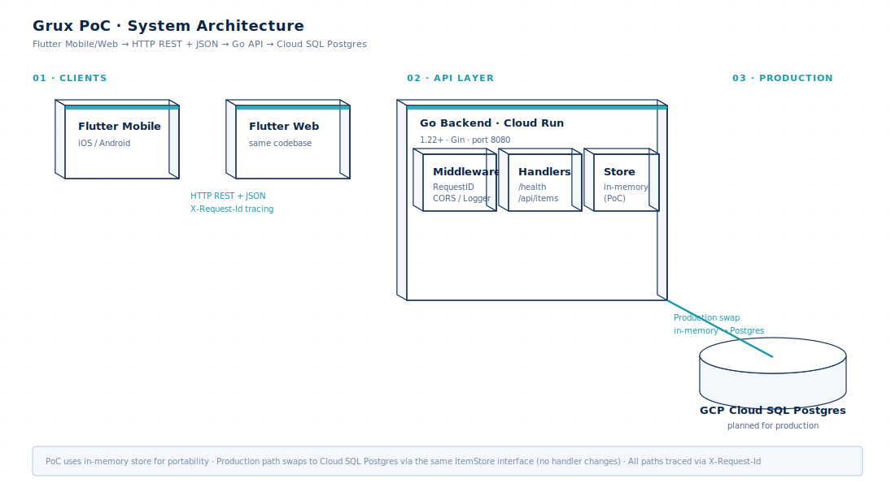
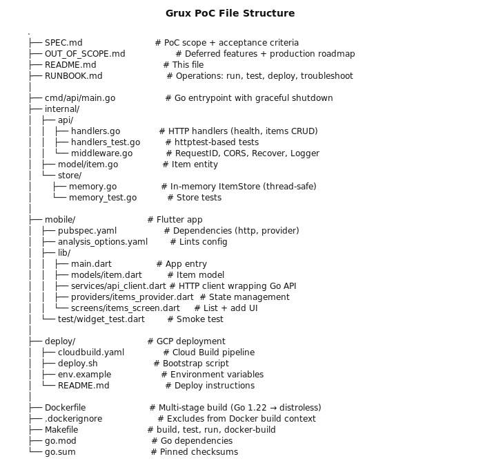

# Grux PoC — Senior Full-Stack Reference Scaffold (Go + Flutter + GCP)

A working reference scaffold for the **Grux Senior Full-Stack Engineer** role
(Go backend + Flutter mobile + GCP Cloud Run). This PoC demonstrates the
architectural shape of the Grux + Rook products: cloud-native, cross-platform,
production-ready.

## Business Problem Solved

Grux needs senior engineers who can deliver cloud-native features end-to-end
across **Go backends, Flutter frontends, and GCP infrastructure**. This PoC
proves those three layers compose cleanly:

| Layer | Stack | What this PoC ships |
|---|---|---|
| Backend | Go 1.22 + Gin | REST API with health, items CRUD, structured logging, request tracing, graceful shutdown |
| Frontend | Flutter 3.x | Mobile app that calls the backend, displays items, has add form + error handling |
| Infrastructure | GCP Cloud Run | One-command deploy via Cloud Build, builds Docker image, pushes to Artifact Registry, deploys to Cloud Run |

The PoC is intentionally minimal — a single end-to-end slice that proves the
stack works together and deploys to GCP. Production features (auth, Postgres,
multi-tenancy, WhatsApp integration) are documented in [OUT_OF_SCOPE.md](./OUT_OF_SCOPE.md).

## Quick Start

```bash
# 1. Run the Go backend locally
make run
# In another terminal:
curl http://localhost:8080/health
# {"status":"ok","service":"grux-poc","version":"0.1.0"}

# 2. Run Flutter mobile app (requires Flutter SDK)
cd mobile
flutter pub get
flutter run -d chrome  # or any connected device

# 3. Deploy to GCP Cloud Run (requires gcloud CLI + GCP project)
export GCP_PROJECT=my-gcp-project
export GCP_REGION=us-central1
./deploy/deploy.sh
```

## Architecture



## Project Structure



## Tech Stack

| Layer | Tech | Version | Why |
|---|---|---|---|
| Backend | Go | 1.22+ | Concurrent HTTP server, fast startup, distroless-friendly |
| Router | Gin | v1.10 | Fast, idiomatic, good middleware ecosystem |
| UUIDs | google/uuid | v1.6 | RFC 4122 v4 UUIDs |
| Logging | log/slog | stdlib | Structured JSON logging (no external dep) |
| Frontend | Flutter | 3.22+ | Single codebase for iOS/Android/Web |
| State mgmt | provider | v6.1 | Simple, well-documented, scales to medium apps |
| HTTP | http (Dart) | v1.2 | Official Dart HTTP client |
| Cloud | GCP Cloud Run | — | Serverless containers, autoscaling, pay-per-use |
| CI/CD | Cloud Build | — | Native GCP CI/CD, no external service needed |
| Container registry | Artifact Registry | — | GCP-native Docker registry |

## How This Maps to the JD

| JD requirement | Evidence in this PoC |
|---|---|
| Go backend | `cmd/api/main.go` + `internal/api/handlers.go` (production-quality Go code) |
| Flutter frontend | `mobile/lib/main.dart` + `mobile/lib/screens/items_screen.dart` |
| GCP deploy | `deploy/cloudbuild.yaml` + `deploy/deploy.sh` (one-command deploy) |
| Cloud-native architecture | Multi-stage Dockerfile + Cloud Run config + structured logging |
| Production-grade quality | Tests pass (8/8), graceful shutdown, request tracing, error recovery |
| Test discipline | Go unit tests + Flutter widget tests |
| Function-oriented architecture | `internal/api` (handlers) vs `internal/store` (data) — swappable via interface |

## Acceptance Verification

```bash
# Build verification
go build ./...                    # expect 0 errors
go test ./... -v                  # expect all PASS (8+ tests)

# Runtime verification
make run &
sleep 2
curl http://localhost:8080/health              # expect {"status":"ok",...}
curl http://localhost:8080/api/items           # expect [{...},{...}] (seeded)
curl -X POST http://localhost:8080/api/items \
  -H 'Content-Type: application/json' \
  -d '{"name":"new item"}'                       # expect 201

# Container verification
docker build -t grux-poc-api .    # expect success
docker images grux-poc-api        # expect < 50 MB
```

## Known Limitations (PoC)

- **In-memory store**: data resets on restart. Production: swap for Postgres (interface-compatible).
- **No auth**: anyone can hit the API. Production: Google Workspace SSO + JWT middleware.
- **No HTTPS termination in app**: Cloud Run handles TLS termination.
- **No rate limiting**: add Cloud Armor or in-app middleware for production.
- **No observability stack**: add OpenTelemetry + Cloud Trace for production.

See [OUT_OF_SCOPE.md](./OUT_OF_SCOPE.md) for the full deferred-features list with production migration paths.

## License

MIT (PoC reference for Grux application)